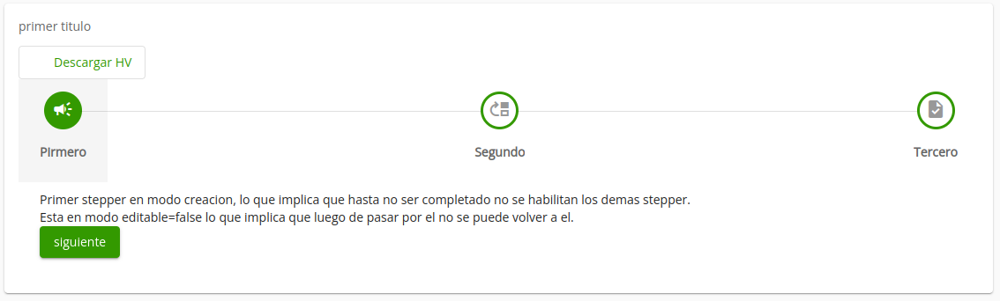

# MAT STEPPER MAIN

Este componente posee todos los estilos (igualmente el responsive) y logica comunmente usada en los steppers.

se puede configurar lo que aparece en la parte superior del stepper, tanto subtitulos para step, como contenido personalizado como botones y demas. Se puede configurar el icono y label de cada step.



## Ejemplo

```html
<app-mat-stepper-main
  [subtitle]="subtitulos"
  (stepper)="setStepper($event)"
  (selectionChange)="selectionChange($event)"
>
  <div step-subtitle>
    <button mat-stroked-button color="primary">
      <mat-icon>clip</mat-icon>
      <span>Descargar HV</span>
    </button>
  </div>
  <ng-template
    stepperContent
    icon="campaign"
    [editable]="false"
    [label]="'Pirmero' | translate"
  >
    Primer stepper en modo creacion, lo que implica que hasta no ser completado no se habilitan los demas stepper.
    <br>
    Esta en modo editable=false lo que implica que luego de pasar por el no se puede volver a el.
    <br>
    <button mat-raised-button color="primary" (click)="crear()">siguiente</button>
  </ng-template>

  <ng-template
    stepperContent
    icon="move_up"
    [label]="'Segundo' | translate"
    [editable]="true"
    [optional]="true"
    [disabled]="!created"
  >
    segundo step deshabilitado hasta darle click al boton de siguiente en el primer step.
  </ng-template>

  <ng-template
    stepperContent
    icon="task"
    [label]="'Tercero' | translate"
    [editable]="true"
    [disabled]="!created"
  >
    tercer step deshabilitado hasta darle click al boton de siguiente en el primer step.
  </ng-template>
</app-mat-stepper-main>
```

## Componente
```ts
export class ExampleComponent {
  /**
   * el texto de la parte superior del stepper, puede ser uno para cada step o una para todos los steps.
   */
  subtitulos: string | string[] = ['primer titulo', 'segundo <strong>titulo</strong>'];

  created = false;

  mystepper:MatStepper = null;

  setStepper($event){
    //evento que retorna el componente mat-stepper
    this.mystepper = $event;
  }

  selectionChange(change) {
    //evento de mat-stepper al ser cambiado el step.
    console.log(change);
  }

  crear(){
    this.created = true;
    this.mystepper.next();
  }
}
```
